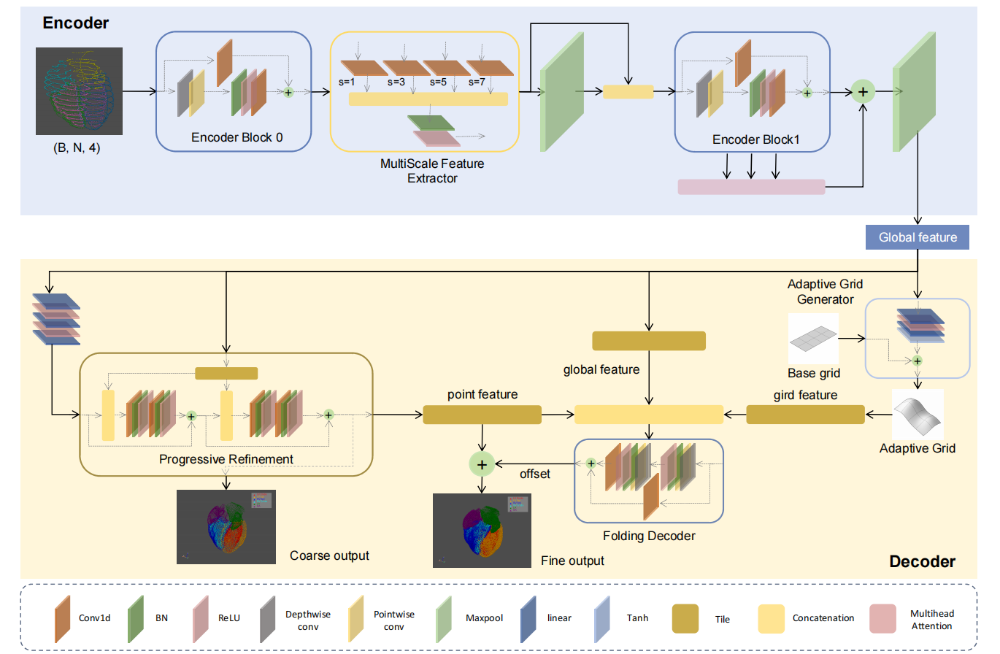
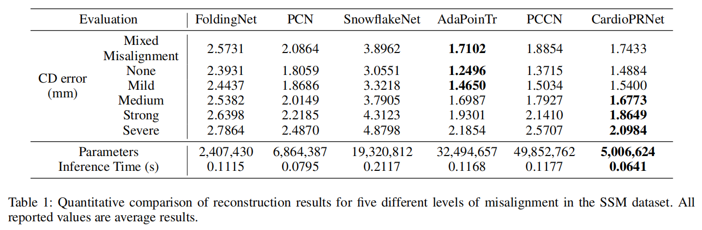
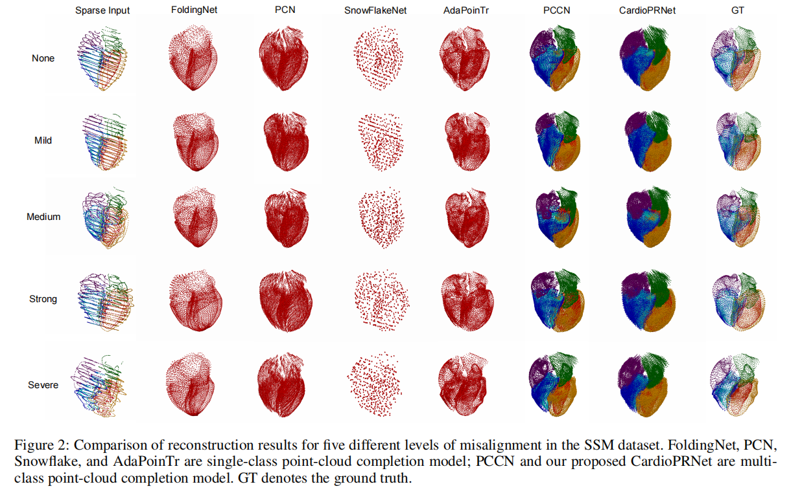

# CardioPRNet: A Lightweight Network with Adaptive Grids and Progressive Refinement for 3D Whole Heart Point Cloud Reconstruction 

## Introduction



This is the proposed CardioPRNet architecture.

## Environment

* Ubuntu 24.04.1 LTS
* Python 3.7.9
* PyTorch 1.7.0
* CUDA 11.0

## Prerequisite

Compile for cd and emd:

```shell
cd extensions/chamfer_distance
python setup.py install
```

**Hint**: Don't compile on Windows platform.

As for other modules, please install by:

```shell
pip install -r requirements.txt
```

## Dataset

- The total size of the dataset is **12.5 GB**. The full dataset will be released on our GitHub repository upon acceptance.
- For convenience, we also include **10 test samples** for evaluation.


## Training

In order to train the model, please use script:

```shell
python train.py --exp_name CardioPRNet --train_data_dir <path of train dataset> --validate_data_dir <path of train dataset>
```

## Testing

In order to test the model, please use follow script:

```shell
python test.py --input_path <path of test dataset> --ckpt_path <path of well-trained model> --log_dir <path of output path> --output <path of output path>
```

## Model

The well-trained model for testing is in `checkpoint/`.

## Results

### Qualitative Result



### Qualitative Result




